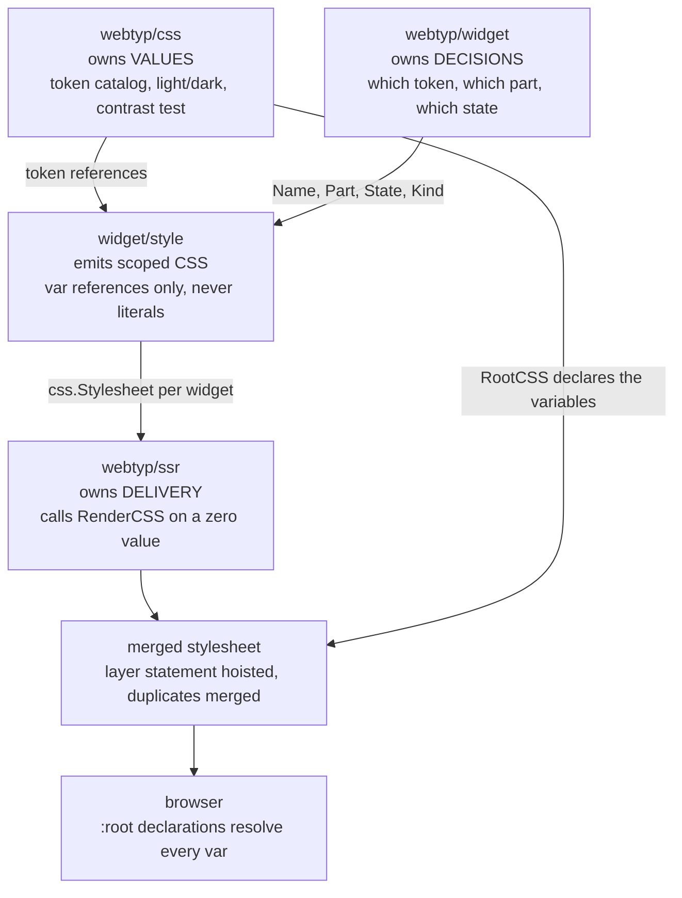
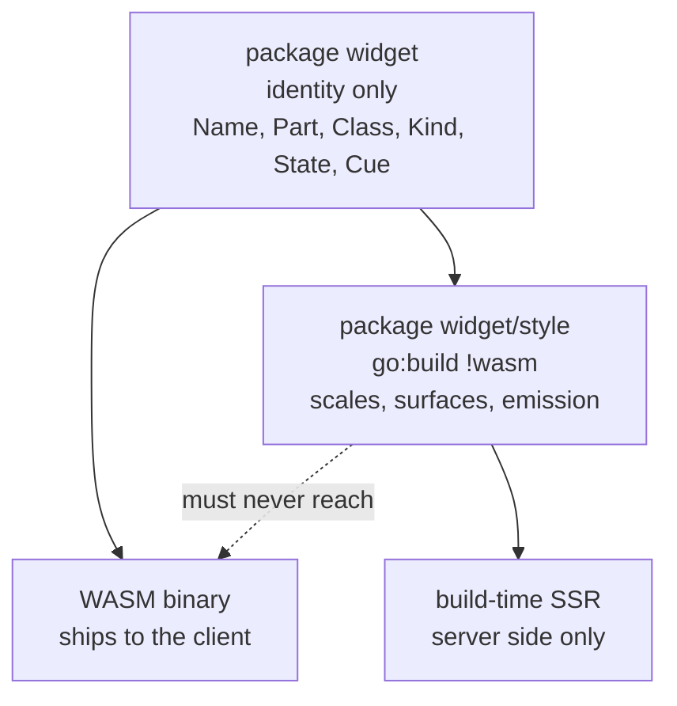

# Module boundaries

How a value reaches the browser, and which module is allowed to decide what.
Context in [ARCHITECTURE.md §2](../ARCHITECTURE.md#2-position-in-the-suite).

The one rule that keeps the split honest: **`widget` never invents a value.**
Every emitted value is a reference to a token `css` declares. The drift guard in
the test suite enforces it — see
[SPECS.md §7.1](../SPECS.md#71-global-invariants).

## WASM boundary

`widget` imports only `webtyp/fmt`. It must not import `webtyp/css`, which is
why `Kind.Layer()` returns an enum and `widget/style` maps it to the `--z-*`
catalog. A test asserts `widget/style` is absent from a consumer's WASM
dependency graph.
